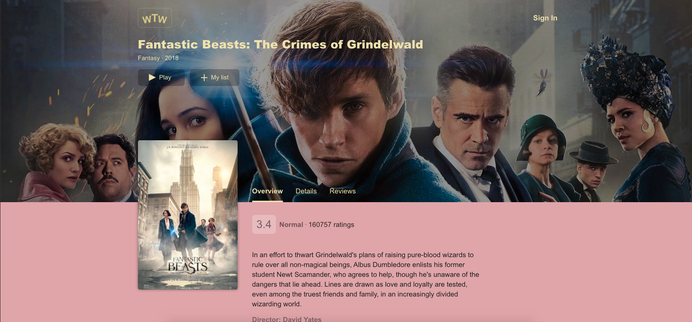

# Личный проект «Что посмотреть» [![Build status][travis-image]][travis-url]

## | Netflix clone created with React |

## WhatToWatch – it's an application, for watching films, it allows you to create your to-watch list, left the reviews, watch the trailers and full films, etc

### *Main page*

### *Login page*

### *Film page*

### *My list page*

### *Review page*

[travis-image]: https://travis-ci.com/htmlacademy-react/583693-what-to-watch-5.svg?branch=master
[travis-url]: https://travis-ci.com/htmlacademy-react/583693-what-to-watch-5
